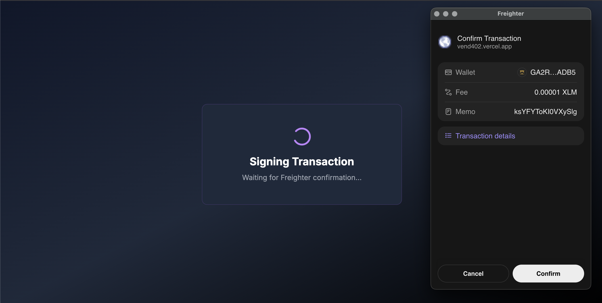
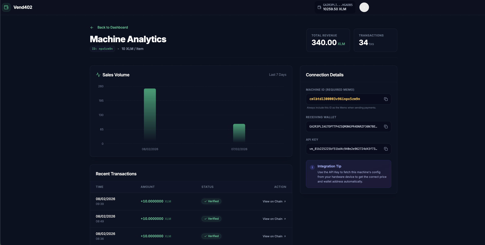
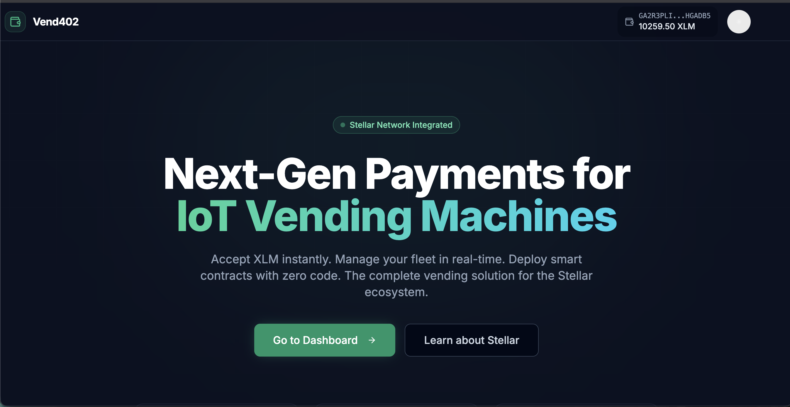
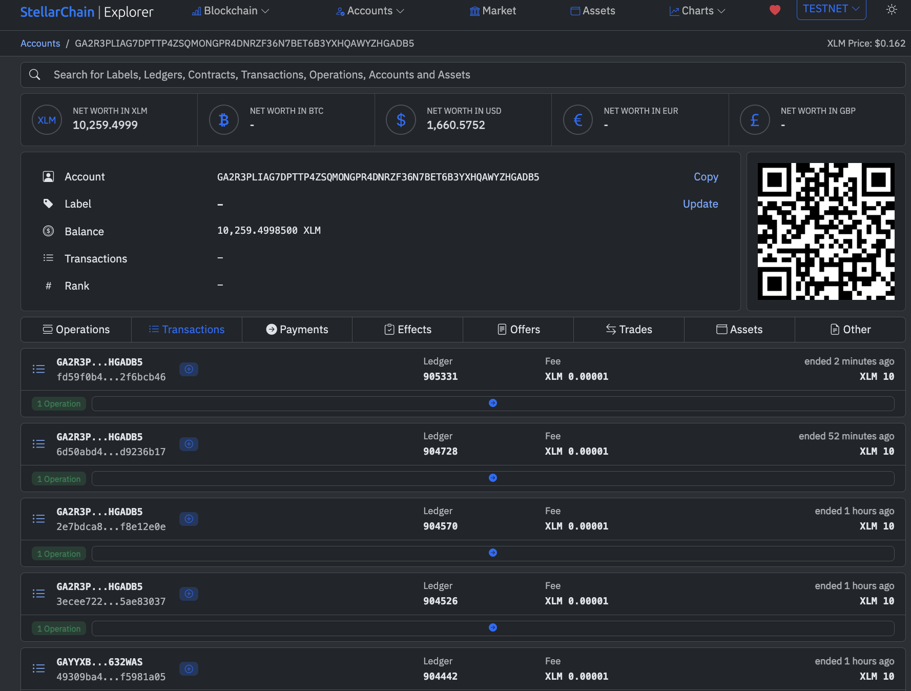

# 🍬 Vend402: Stellar X402 Vending Machine
**Stellar Community Hackathon Submission**

> **A "Leakproof" Blockchain Vending Machine using Native Stellar Payments, Supabase Edge Functions, and ESP32 Hardware.**

## 🌐 Deployed Link
*   **Merchant Dashboard**: [https://vend402.vercel.app](https://vend402.vercel.app) 

---

## 📄 Contract Address / Protocol Details
Since this project utilizes **Stellar's Native Payment Operations** (X402 Protocol) instead of a custom Smart Contract, we provide the following protocol details:

*   **Protocol**: X402 (HTTP 402 Payment Required)
*   **Network**: Stellar Testnet
*   **Gatekeeper Logic**: [Supabase Edge Function Source Code](Vend402/supabase/functions/vend402-gatekeeper/index.ts)

---

## 🎯 Problem Statement
**"Smart Contracts are overkill for buying a soda."**

Traditional blockchain vending machines often rely on complex EVM smart contracts to handle simple payments. This introduces:
1.  **High Gas Fees**: Paying $2 in gas for a $1 soda is impractical.
2.  **Latency**: Waiting 15+ seconds for block confirmation is bad UX.
3.  **Complexity**: Smart contracts introduce security risks (re-entrancy, logic bugs) for simple value transfers.

**The Solution? Vend402.**
We strip away the complexity by using the **X402 Protocol**. We treat the vending machine as a web resource that requires payment. The logic is handled by a secure, off-chain "Gatekeeper" (Oracle) that monitors the Stellar Ledger for native, lightning-fast XLM payments.

---

## ✨ Features
*   **⚡ Instant Payments**: Powered by Stellar's native payment operations (< 5s finality).
*   **🔒 Leakproof Security**:
    *   **Price Enforcement**: Strict validation prevents underpayment attacks.
    *   **Replay Protection**: Prevents double-spending of the same transaction hash.
    *   **Secure Hardware Signal**: Authenticated WebSocket channel prevents spoofing.
*   **📊 Merchant Dashboard**: Real-time sales analytics, revenue charts, and machine management.
*   **📱 Freighter Integration**: Seamless, secure signing experience for users.
*   **🤖 Hardware Ready**: Plug-and-play code for ESP32 devices with LCDs and Relays.

---

## 🏗️ Architecture Overview

The system follows a **Ternary Architecture**:

1.  **Frontend (The Intermediary)**:
    *   Next.js 14 App requests a `Challenge` from the Gatekeeper.
    *   User signs the challenge (Transaction with Memo) using **Freighter**.
    *   Frontend submits the signed transaction to Horizon.

2.  **Gatekeeper (The Brain)**:
    *   Supabase Edge Function (Deno/TypeScript).
    *   **Verifies** the transaction on the Stellar Ledger (correct amount, destination, memo).
    *   **Updates** the database (Supabase).
    *   **Broadcasts** a `dispense` signal via secure WebSocket.

3.  **Hardware (The Muscle)**:
    *   ESP32 Microcontroller.
    *   Listens to the private WebSocket channel.
    *   Triggers the physical Relay/Motor to dispense the item.
---

## 📸 Screenshots

| **Payment Page** | **Merchant Dashboard** |
|:---:|:---:|
|  |  |
| *User scans QR or pays via Link* | *Real-time Sales & Revenue* |

| *Landing Page* | **Stellar Explorer Signing** |
|:---:|:---:|
|  |  |

---

## 🚀 Future Scope
1.  **Soroban Escrow**: For high-value items (e.g., Car Vending Machines), we plan to implement Soroban Smart Contracts to hold funds in escrow until physical delivery is verified by IoT sensors.
2.  **DAO Management**: Allow a DAO to own a fleet of machines, with revenue automatically distributed to token holders via functionality like Stellar Asset Clawback/Distribution.
3.  **Global Fleet**: Expand the dashboard to manage thousands of machines across the globe with over-the-air (OTA) firmware updates.

---

## 🛠️ Tech Stack
*   **Stellar SDK**: Transaction building & Horizon interaction.
*   **Stellar x402**: Transaction building.
*   **Freighter**: Wallet provider.
*   **Supabase**: Database (PostgreSQL), Edge Functions, Realtime.
*   **Next.js 14**: React Framework with Tailwind CSS & Shadcn UI.
*   **Arduino/C++**: Firmware for ESP32.

---

### Developed for the Stellar Buildathon 2026.
